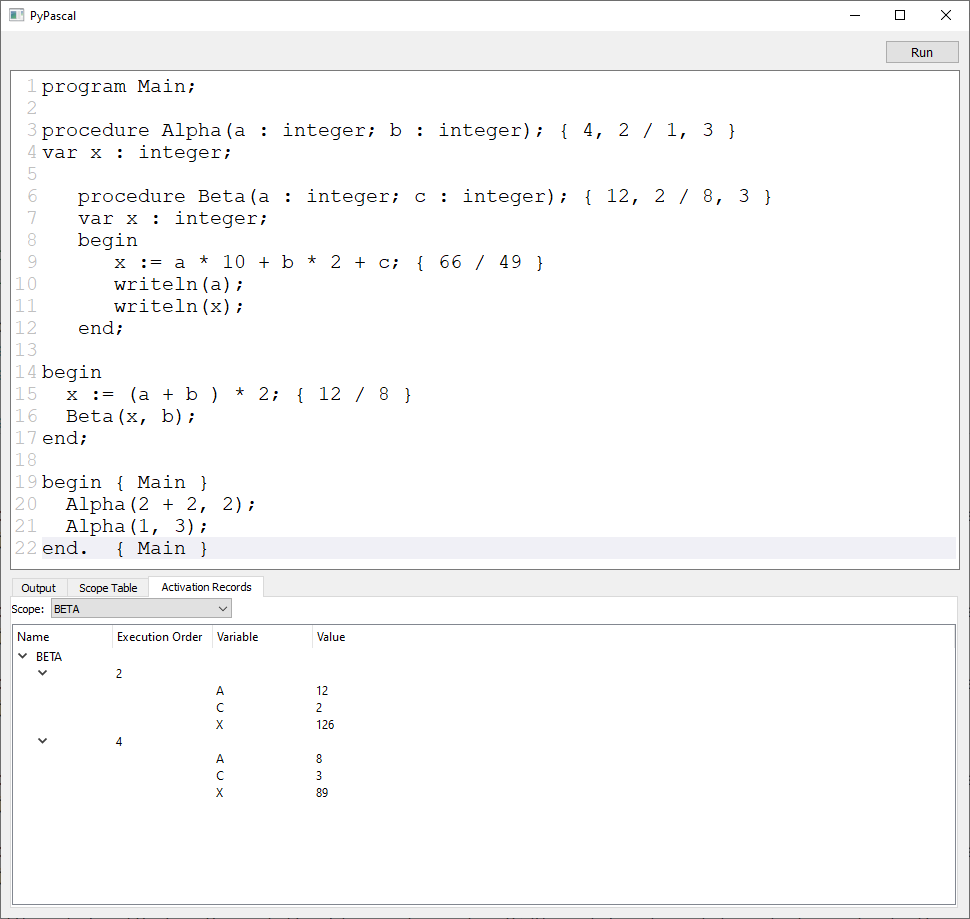

[](https://wakatime.com/badge/user/ec8c97a0-e0e3-4763-a6b4-374bde6dcd04/project/9766bc6d-e05f-46c2-b83c-0c0602728a07)

# Pascal Interpreter

A simple Pascal interpreter based on [Let's Build a Simple Interpreter](https://github.com/rspivak/lsbasi) series by [Ruslan Spivak](https://github.com/rspivak/) with usage of [EBNF grammar tester](https://mdkrajnak.github.io/ebnftest/) by [mdkrajnak](https://github.com/mdkrajnak/), [TatSu](https://github.com/neogeny/TatSu) and [railroad diagrams](https://github.com/tabatkins/railroad-diagrams).

## Project structure

- `.github/workflows` - workflows for running tests
- `base` - files for building the interpreter at its current state
- `part [1-9][0-9]*( - [a-zA-Z ]*)?` - part that reflects the state of the interpreter at the end of the corresponding part of the series
- `src` - images for this README
- `test` - test modules and test files for the interpreter in each part

## Current state

- Implemented all parts of the series (part 19 implemented in part 18)
- Additionally implemented:
  - Procedures can access non-local variables
  - UI with following output:
    - Standard and error output
    - Table with scopes
    - Activation records for each scope


<details>
<summary>Sample program</summary>
<br>
<pre>
program Main;

procedure Alpha(a : integer; b : integer); { 4, 2 / 1, 3 }
var x : integer;

   procedure Beta(a : integer; c : integer); { 12, 2 / 8, 3 }
   var x : integer;
   begin
      x := a * 10 + b * 2 + c; { 66 / 49 }
      writeln(a);
      writeln(x);
   end;

begin
  x := (a + b ) * 2; { 12 / 8 }
  Beta(x, b);
end;

begin { Main }
  Alpha(2 + 2, 2);
  Alpha(1, 3);
end.  { Main }
</pre>
</details>

## Grammar

```ebnf
# Program

<program> ::= <PROGRAM> <variable> <SEMI> <block> <DOT>

# Block

<block> ::= <declarations> <compound_statement>

# Declaration

<declarations> ::= <VAR> { <variable_declaration> <SEMI> }+
                | { <PROCEDURE> <ID> <SEMI> <block> <SEMI> }*
                | <empty>

<variable_declaration> ::= <ID> { <COMMA> <ID> }* <COLON> <type_spec>

<type_spec> ::= <INTEGER_TYPE> | <REAL_TYPE>

# Statement

<compound_statement> ::= <BEGIN> <statement_list> <END>

<statement_list> ::= <statement> { <SEMI> <statement_list> }*

<statement> ::= <compound_statement>
              | <procedure_call_statement>
              | <assignment_statement>
              | <empty>

<assignment_statement> ::= <variable> <ASSIGN> <expression>

<procedure_call_statement> ::= <ID> <LPAREN> [ <expression> { <COMMA> <expression> }* ] <RPAREN>

<empty> ::= ''

# Mathemathical Expression

<expression> ::= <term> { (<PLUS> | <MINUS>) <term> }*

<term> ::= <factor> { (<MUL> | <INTEGER_DIV> | <FLOAT_DIV>) <factor> }*

<factor> ::= <PLUS> <factor>
           | <MINUS> <factor>
           | <INTEGER>
           | <REAL>
           | <LPAREN> <expression> <RPAREN>
           | <variable>

# Variables

<variable> ::= <ID>

<ID> ::= [a-zA-Z_][a-zA-Z0-9_]*

# Numerical Values

<INTEGER> ::= <digit>+
<REAL> ::= <digit>+ [ <DOT> <digit>+ ]

<digit> ::= '0' | '1' | '2' | '3' | '4' | '5' | '6' | '7' | '8' | '9'

# Reserved words

<PROGRAM> ::= 'PROGRAM'
<BEGIN> ::= 'BEGIN'
<END> ::= 'END'
<VAR> ::= 'VAR'
<INTEGER_TYPE> ::= 'INTEGER'
<REAL_TYPE> ::= 'REAL'

# Symbols

<DOT> ::= '.'
<SEMI> ::= ';'
<COMMA> ::= ','
<COLON> ::= ':'
<LPAREN> ::= '('
<RPAREN> ::= ')'

# Operators

<ASSIGN> ::= ':='
<PLUS> ::= '+'
<MINUS> ::= '-'
<MUL> ::= '*'
<FLOAT_DIV> ::= '/'
<INTEGER_DIV> ::= 'DIV'
```

## Diagram

### Program


### Block


### Declarations


### Variable Declaration


### Type Specification


### Compound Statement


### Statement List


### Statement


### Assignment Statement


### Procedure Call Statement


### Empty Statement


### Expression


### Term


### Factor


### Variable


