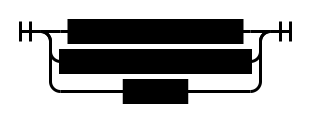
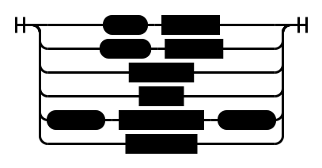

# Part 14 - Practice

## Grammar

```ebnf
# Program

<program> ::= <PROGRAM> <variable> <SEMI> <block> <DOT>

# Block

<block> ::= <declarations> <compound_statement>

# Declaration

<declarations> ::= <VAR> { <variable_declaration> <SEMI> }+
                | { <PROCEDURE> <ID> <SEMI> <block> <SEMI> }*
                | <empty>

<variable_declaration> ::= <ID> { <COMMA> <ID> }* <COLON> <type_spec>

<type_spec> ::= <INTEGER_TYPE> | <REAL_TYPE>

# Statement

<compound_statement> ::= <BEGIN> <statement_list> <END>

<statement_list> ::= <statement> { <SEMI> <statement_list> }*

<statement> ::= <compound_statement>
              | <assignment_statement>
              | <empty>

<assignment_statement> ::= <variable> <ASSIGN> <expression>

<empty> ::= ''

# Mathemathical Expression

<expression> ::= <term> { (<PLUS> | <MINUS>) <term> }*

<term> ::= <factor> { (<MUL> | <INTEGER_DIV> | <FLOAT_DIV>) <factor> }*

<factor> ::= <PLUS> <factor>
           | <MINUS> <factor>
           | <INTEGER>
           | <REAL>
           | <LPAREN> <expression> <RPAREN>
           | <variable>

# Variables

<variable> ::= <ID>

<ID> ::= [a-zA-Z_][a-zA-Z0-9_]*

# Numerical Values

<INTEGER> ::= <digit>+
<REAL> ::= <digit>+ [ <DOT> <digit>+ ]

<digit> ::= '0' | '1' | '2' | '3' | '4' | '5' | '6' | '7' | '8' | '9'

# Reserved words

<PROGRAM> ::= 'PROGRAM'
<BEGIN> ::= 'BEGIN'
<END> ::= 'END'
<VAR> ::= 'VAR'
<INTEGER_TYPE> ::= 'INTEGER'
<REAL_TYPE> ::= 'REAL'

# Symbols

<DOT> ::= '.'
<SEMI> ::= ';'
<COMMA> ::= ','
<COLON> ::= ':'
<LPAREN> ::= '('
<RPAREN> ::= ')'

# Operators

<ASSIGN> ::= ':='
<PLUS> ::= '+'
<MINUS> ::= '-'
<MUL> ::= '*'
<FLOAT_DIV> ::= '/'
<INTEGER_DIV> ::= 'DIV'
```

## Diagram

### Program


### Block


### Declarations


### Variable Declaration


### Type Specification


### Compound Statement


### Statement List


### Statement



### Assignment Statement


### Empty Statement


### Expression


### Term


### Factor



### Variable


## Tasks

1. You’ve seen in the pictures throughout the article that the Main name in a program statement had subscript zero. I also mentioned that the program’s name is not in the global scope and it’s in some other outer scope that has level zero. Extend [spi.py](https://github.com/rspivak/lsbasi/blob/master/part14/spi.py) and create a builtins scope, a new scope at level 0, and move the built-in types INTEGER and REAL into that scope. For fun and practice, you can also update the code to put the program name into that scope as well.
2. For the source program in [nestedscopes04.pas](https://github.com/rspivak/lsbasi/blob/master/part14/nestedscopes04.pas) do the following:
    1. Write down the source Pascal program on a piece of paper
    2. Subscript every name in the program indicating the scope level of the declaration the name resolves to.
    3. Draw vertical lines for every name declaration (variable and procedure) to visually show its scope. Don’t forget about scope holes and their meaning when drawing.
    4. Write a source-to-source compiler for the program without looking at the example source-to-source compiler in this article.
    5. Use the original [src2srccompiler.py](https://github.com/rspivak/lsbasi/blob/master/part14/src2srccompiler.py) program to verify the output from your compiler and whether you subscripted the names correctly in the exercise (2.2).


3. Modify the source-to-source compiler to add subscripts to the built-in types INTEGER and REAL

4. Uncomment the following block in the [spi.py](https://github.com/rspivak/lsbasi/blob/master/part14/spi.py)

```python
# interpreter = Interpreter(tree)
# result = interpreter.interpret()
# print('')
# print('Run-time GLOBAL_MEMORY contents:')
# for k, v in sorted(interpreter.GLOBAL_MEMORY.items()):
#     print('%s = %s' % (k, v))
```

Run the interpreter with the [part10.pas](https://github.com/rspivak/lsbasi/blob/master/part10/python/part10.pas) file as an input:

```bash
$ python spi.py part10.pas
```

Spot the problems and add the missing methods to the semantic analyzer.

## Reference

https://ruslanspivak.com/lsbasi-part14/
